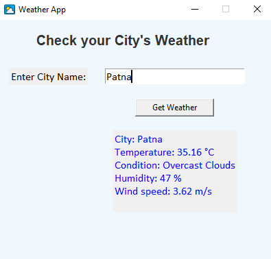

# 🌦 Weather App – GUI using Tkinter + OpenWeatherMap API

A simple and user-friendly desktop weather application built with Python.  
It uses Tkinter for the GUI and OpenWeatherMap API to fetch real-time weather data based on city input.

---

## 📌 Features

- ✅ Live weather report of any city
- ✅ Temperature, humidity, pressure – all in one place
- ✅ Clean and attractive GUI (Tkinter)
- ✅ Easy to use for beginners
- ✅ Fast API response using requests module

---

## 🛠 Technologies Used

| Tool              | Purpose                    |
|-------------------|----------------------------|
| Python 🐍         | Core language              |
| Tkinter 🎨        | GUI framework              |
| Requests 🌐       | To call the weather API    |
| OpenWeatherMap 🌦  | Real-time weather data     |

---

## 📡 How it Works

1. User enters city name in the input field.
2. App sends a request to OpenWeatherMap API.
3. Weather data is fetched and displayed on the GUI.

---

## 🖼 App Preview

